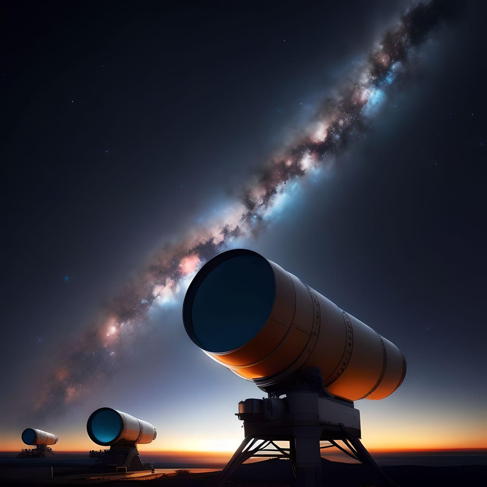
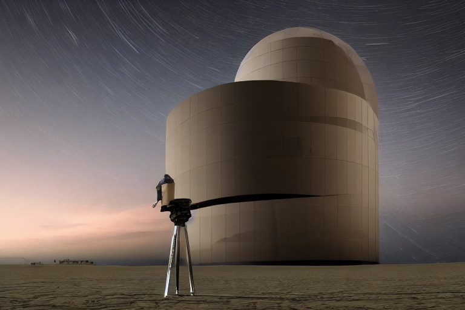

## Updates

### About Nitesh Kumar

{: .img-responsive}

I am a passionate machine learning researcher in the field of astronomy and astrophysics, dedicated to unraveling the mysteries of the universe through data-driven approaches. With a strong background in physics and astrophysics, I combine my expertise in machine learning algorithms with my love for the cosmos to contribute to the advancement of astronomical knowledge.

{: .img-responsive}

My research focuses on applying state-of-the-art machine learning techniques to analyze astronomical datasets. I have a particular interest in studying variable stars, such as RR Lyrae stars, and their behavior. By developing innovative algorithms and models, I aim to extract valuable information from these celestial objects, enabling a deeper understanding of their intrinsic properties and evolution.

Throughout my academic journey, I have collaborated with esteemed astronomers and researchers, and I have actively contributed to the field through scientific publications and conference presentations. I have also been involved in organizing workshops and seminars, aiming to disseminate knowledge and foster collaboration among fellow researchers.

{: .img-responsive}

I hold a Senior Research Fellow position at the Department of Physics and Astrophysics, University of Delhi. My academic journey has equipped me with a diverse skill set, including data preprocessing, feature engineering, algorithm development, and statistical analysis. I continually strive to expand my knowledge and stay at the forefront of emerging trends in both machine learning and astrophysics.

If you would like to collaborate, discuss research ideas, or simply share your fascination with the cosmos, feel free to connect with me. You can reach me via email at [niteshchandra039@gmail.com](mailto:niteshchandra039@gmail.com) or connect on [LinkedIn](http://www.linkedin.com/in/astro-nitesh).

Please visit the [Homepage](index.md) for an overview of my research and projects.

To stay informed about my recent work and publications, check out the [Updates](update.md) section.

Thank you for visiting my page and your interest in my research!

Best regards,  
Nitesh Kumar